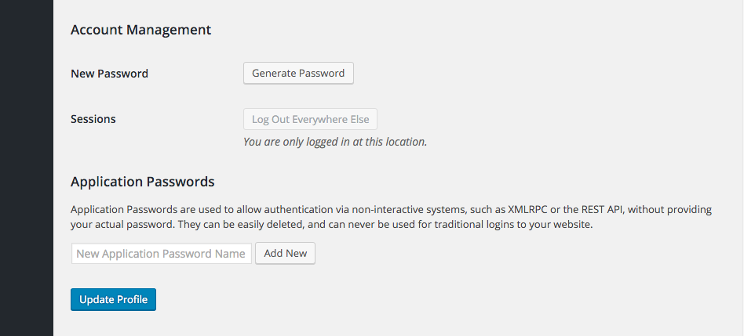
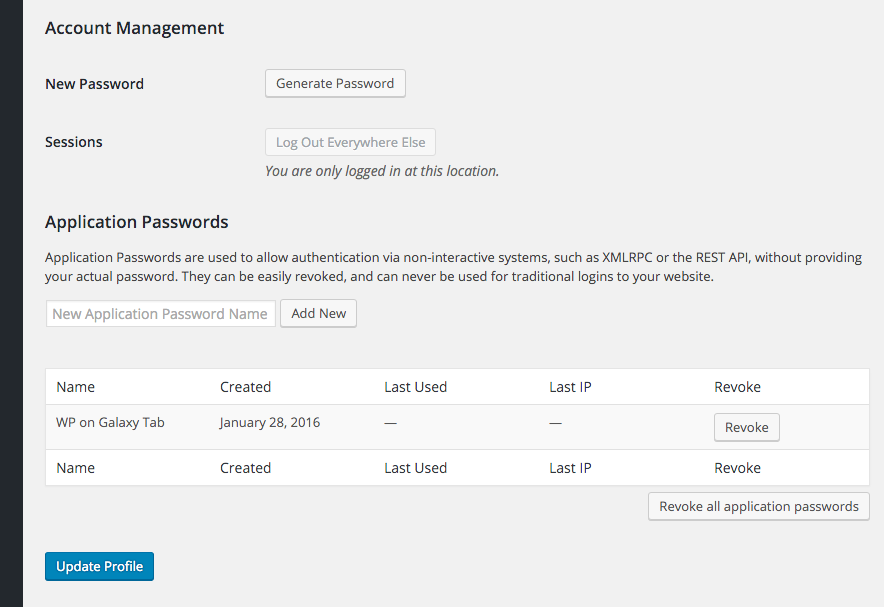

<!-- DO NOT EDIT THIS FILE; it is auto-generated from readme.txt -->
# Application Passwords

A feature plugin for core to provide Application Passwords

**Contributors:** [georgestephanis](https://profiles.wordpress.org/georgestephanis), [valendesigns](https://profiles.wordpress.org/valendesigns), [kraftbj](https://profiles.wordpress.org/kraftbj)  
**Tags:** [application-passwords](https://wordpress.org/plugins/tags/application-passwords), [rest api](https://wordpress.org/plugins/tags/rest-api), [xml-rpc](https://wordpress.org/plugins/tags/xml-rpc), [security](https://wordpress.org/plugins/tags/security), [authentication](https://wordpress.org/plugins/tags/authentication)  
**Requires at least:** 4.4  
**Tested up to:** 4.9  
**Stable tag:** trunk (master)  
**License:** [GPLv2 or later](http://www.gnu.org/licenses/gpl-2.0.html)  

[](https://travis-ci.org/kasparsd/application-passwords) [](https://coveralls.io/github/kasparsd/application-passwords) 

## Description ##

This is a feature plugin that is a spinoff of the main Two-Factor Authentication plugin, found at https://github.com/georgestephanis/two-factor/.

With Application Passwords you are able to authenticate a user without providing that user's password directly, instead you will use a base64 encoded string of their username and a new application password.

## Installation ##

1. Download the zip file.
2. Log into WordPress, hover over *Plugins*, and click *Add New*.
3. Click on the *Upload Plugin* button.
4. Select the zip file you downloaded.
5. Click *Install Plugin*.
6. Activate.

## Screenshots ##

### In your user profile screen, by default it will just be a field to create a new Application Password.



### After at least one Application Password for you account exists, you'll see a table displaying them, allowing you to view usage and revoke them as desired.



## Creating a New Application Password ##

### For an application to get a user to generate an application password:

Direct the user to `http://example.com/wp-admin/admin.php?page=auth_app`

The following GET variables are supported currently to append to ^^ that url

- `app_name` - ( required-ish ) - The human readable identifier for your app.  This will be the name of the generated application password, so structure it like ... "WordPress Mobile App on iPhone 5" for uniqueness between multiple versions.  If omitted, the user will be required to provide an application name.
- `success_url` - ( recommended ) - The URL that you'd like the user to be sent to if they approve the connection.  Two GET variables will be appended when they are passed back -- `user_login` and `password` -- these credentials can then be used for API calls.  If the `success_url` variable is omitted, a password will be generated and displayed to the user, to manually enter into your application.
- `reject_url` - ( optional ) - If included, the user will get sent there if they reject the connection.  If omitted, the user will be sent to the `success_url`, with `?success=false` appended to the end.  If the `success_url` is omitted, the user will be sent to their dashboard.

### For a user to manually generate an application password:

1. Go the User Profile page of the user that you want to generate a new application password for.  To do so, click *Users* on the left side of the WordPress admin, then click on the user that you want to manage.
2. Scroll down until you see the Application Passwords section.  This is typically at the bottom of the page.
3. Within the input field, type in a name for your new application password, then click *Add New*.
   **Note:** The application password name is only used to describe your password for easy management later.  It will not affect your password in any way.  Be descriptive, as it will lead to easier management if you ever need to change it later.
4. Once the *Add New* button is clicked, your new application password will appear.  Be sure to keep this somewhere safe, as it will not be displayed to you again.  If you lose this password, it cannot be obtained again.

## Testing an Application Password ##

### WordPress REST API

This test uses the technologies listed below, but you can use any REST API request.

* WordPress REST API
* cURL
* Mac OSX or Linux
* A Mac or Linux terminal
* Local development environment (e.g. MAMP, XAMPP, DesktopServer, Vagrant) running on localhost

1. Now that you have your new password, you are now able to make a simple REST API call using the terminal window to update a post. If authorized correctly, you will see the post title update to "New Title."
```shell
curl --user "USERNAME:APPLICATION_PASSWORD" -X POST -d "title=New Title" http://LOCALHOST/wp-json/wp/v2/posts/POST_ID
```
   When running this command, be sure to replace *USERNAME* and *APPLICATION_PASSWORD* with your credentials, *LOCALHOST* with the location of your local WordPress installation, and *POST_ID* with the ID of the post that you want to edit.

### XML-RPC

This test uses the technologies listed below, but you can use any XML-RPC request.

* XML-RPC enabled within WordPress
* cURL
* Mac OSX or Linux
* A Mac or Linux terminal
* Local development environment (e.g. MAMP, DesktopServer, Vagrant) running on localhost

Once you have created a new application password, it's time to send a request to test it.  Unlike the WordPress REST API, XML-RPC does not require your username and password to be base64 encoded.  To begin the process, open a terminal window and enter the following:
```shell
curl -H 'Content-Type: text/xml' -d '<methodCall><methodName>wp.getUsers</methodName><params><param><value>1</value></param><param><value>USERNAME</value></param><param><value>APPLICATION_PASSWORD</value></param></params></methodCall>' LOCALHOST
```
In the above example, replace *USERNAME* with your username, and *APPLICATION_PASSWORD* with your new application password.  This should output a response containing all users on your site.

